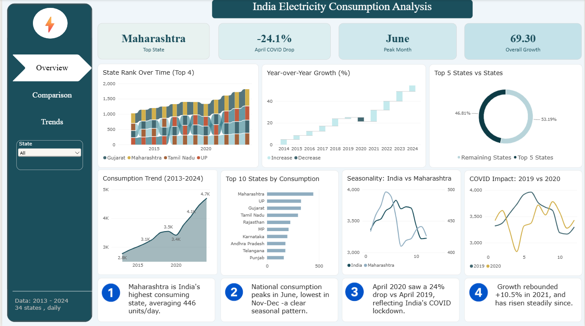
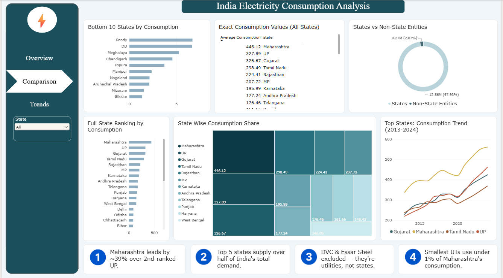
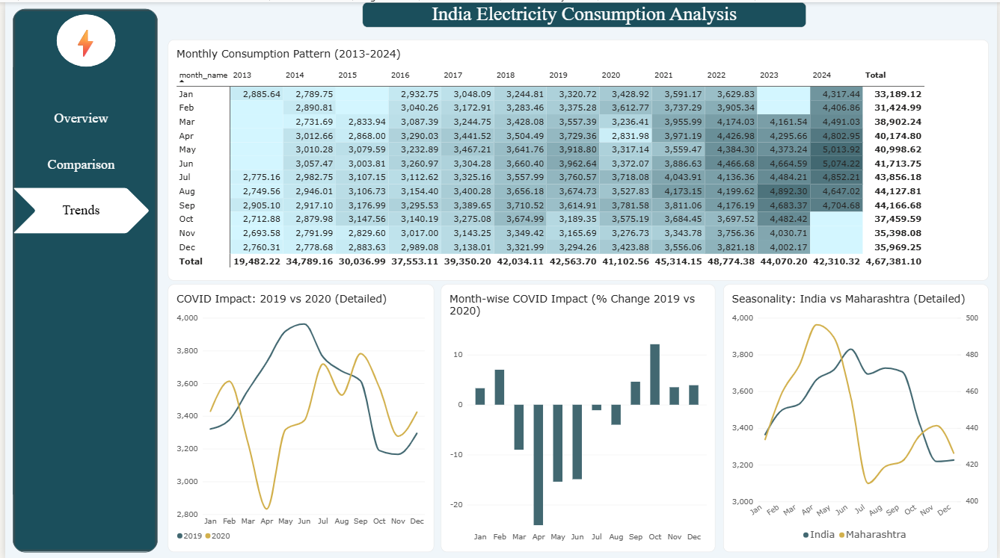

# India Electricity Consumption Analysis

A SQL + Power BI project analyzing 11 years of daily electricity consumption across Indian states, built to support grid capacity planning decisions.

## Business Problem

Grid planners need to know **when** and **in which states** electricity demand peaks, so they can plan capacity ahead of time, prioritize investment across states, and understand how demand responds to extreme disruptions (like COVID-19 lockdowns). This project analyzes 11 years of state-wise daily consumption data to answer:
- When does national demand peak, and does it vary by state?
- Which states consume the most, and by how much?
- How did the COVID-19 lockdown affect demand, and how fast did it recover?

## Dataset

- **Source:** State-wise daily electricity consumption, India
- **Size:** 3,707 daily records × 36 states/UTs, Jan 2013 – Sep 2024
- **Known gaps:** ~578 dates missing across the period (notably 2013 and 2024, which are partial years); `Total Consumption` and a few state columns had scattered nulls, which were corrected during cleaning (see below) rather than dropped

## Tools Used

- **Excel** — initial exploration, null/outlier spotting, quick pivot validation
- **MySQL** — all data cleaning, transformation, and analysis logic (views)
- **Power BI** — dashboard and visualization layer, built directly on top of SQL views

## Process

1. **Exploration (Excel):** Identified missing dates, structural nulls (DD, DNH, Pondy, Tripura, Essar Steel had long stretches of no data), and two data-entry outliers (HP and Karnataka, 2017).
2. **Cleaning (MySQL):** Imported the raw CSV, fixed a bug where missing values had been loaded as `0` instead of `NULL` (confirmed and corrected for every affected column, including `Total Consumption` itself), and converted date strings to proper `DATE` type.
3. **Transformation (MySQL):** Reshaped the wide table (one column per state) into a long format (`date, state, consumption`) for state-wise analysis, and built reusable **SQL views** for each analysis:
   - `monthly_seasonality` — month-wise average consumption, national and Maharashtra
   - `state_ranking` — average consumption by state (DVC and Essar Steel excluded — they're a utility and an industrial consumer, not states)
   - `covid_comparison` — month-wise 2019 vs 2020 comparison with % change
   - `yoy_growth` — year-over-year average consumption and % growth
   - `monthly_yearly_grid` — year × month grid for the heatmap
   - `state_yearly_trend` / `top5_vs_rest` / `states_vs_others` — supporting views for comparison visuals
4. **Dashboard (Power BI):** Built a 3-page report directly on these views — no calculations were redone in Power BI itself.

Full SQL (table setup, cleaning, views) is in [`queries.sql`](queries.sql); all Power BI DAX measures are in [`measures.txt`](measures.txt).

## Key Insights

- **Maharashtra is India's highest-consuming state**, averaging 446 units/day — about 36% ahead of 2nd-ranked Uttar Pradesh (328).
- **National demand peaks in June** and is lowest in November–December, a clear summer-driven seasonal pattern. Maharashtra's own peak falls earlier, in April.
- **April 2020 saw a 24% drop** in consumption vs. April 2019, reflecting India's COVID-19 lockdown — the sharpest monthly dip in the dataset.
- **Demand rebounded quickly**: growth went from -3.8% (2020) to +10.5% (2021), and has grown steadily (8-9% YoY) since.
- The top 5 states account for over half of India's total electricity demand.

## Dashboard

**Page 1 — Overview:** KPI cards (top state, peak month, COVID drop, overall growth), consumption trend, top states, seasonality, COVID comparison, YoY waterfall, and state-share breakdowns.

**Page 2 — Comparison:** Full 34-state ranking, bottom 10 states, exact values table, state-vs-entity breakdown, and a top-4 states trend line.

**Page 3 — Trends:** Month × year consumption heatmap, detailed seasonality and COVID comparisons, and month-wise COVID % impact.

## Notes on Data Quality

- 2013 and 2024 are partial years (153 and 266 days respectively) — all comparisons use daily averages, not annual sums, to avoid skew.
- A small number of likely data-entry errors (e.g., Himachal Pradesh and Karnataka readings in 2017) were identified but left in the dataset; they do not materially affect the averages reported here.
- "States" in the ranking exclude DVC (a power utility) and Essar Steel (an industrial consumer) — both are large non-state entities present in the raw data.
